# LLM on Kubernetes, Instrumented for Reliability

Running an open-source LLM on a single-node Kubernetes cluster where the interesting problem isn't *getting it to run* — it's knowing, continuously, whether it's actually producing tokens at an acceptable latency.

[](https://kind.sigs.k8s.io/)
[](https://ollama.com/)
[](https://ollama.com/library/llama3.2)
[](https://github.com/prometheus-community/helm-charts)
[](https://grafana.com/)
[](https://www.python.org/)
[](https://react.dev/)
[](https://vite.dev/)
[](LICENSE)

**📝 Write-up:** [How to Deploy an Open Source LLM Reliably](https://chinmoypaul.hashnode.dev/how-to-deploy-an-open-source-llm-reliably) &nbsp;·&nbsp; **🎥 Walkthrough:** [6-minute demo](https://youtu.be/ZlbAAsjmpdo)

---


<table>
<tr>
<td width="50%">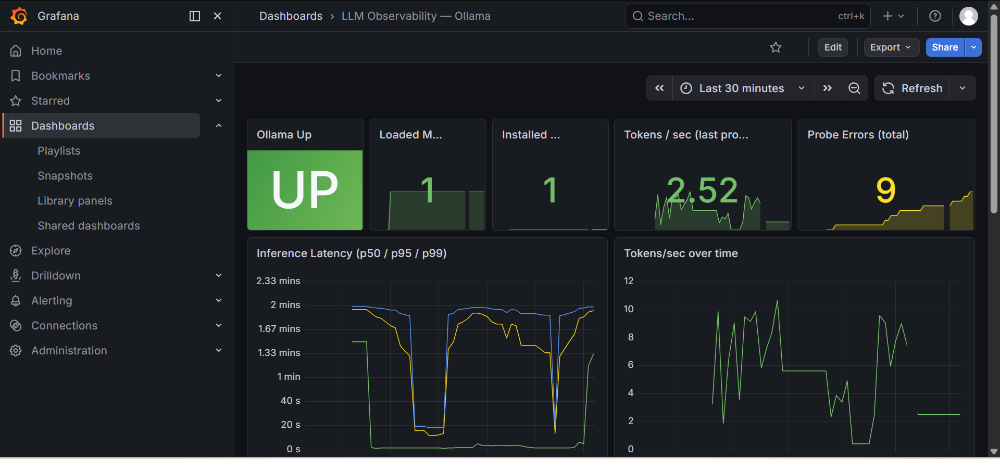</td>
<td width="50%">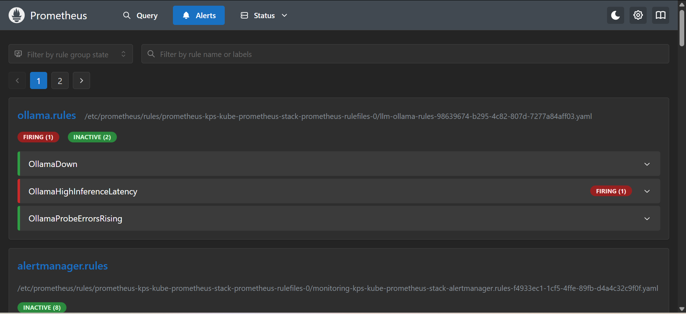</td>
</tr>
<tr>
<td align="center"><em>Custom LLM dashboard — 11 panels fed by a purpose-built exporter</em></td>
<td align="center"><em><code>OllamaHighInferenceLatency</code> firing on real degradation, not a synthetic load test</em></td>
</tr>
</table>

> Both screenshots above are captures from the real cluster run. The chat/benchmark GIF was recorded from an isolated copy of the UI against a local mock, so it contains no live API traffic.

---

## The problem

Most "deploy an LLM on Kubernetes" guides stop at `kubectl get pods` showing `Running`. That tells you almost nothing:

- Ollama's HTTP server binds in about a second. The model takes far longer to become usable. A TCP or `GET /` probe reports **healthy** during that entire window, and the first real request times out.
- Once it's serving, nothing in a stock kube-prometheus-stack install knows what a token is. You get CPU and memory working set for the pod. You don't get inference latency, throughput, or whether the model is still resident in RAM.
- Ollama exposes **no** Prometheus endpoint of its own.

So the observable surface has to be built. This repo builds it, on an 8 GB laptop, where the monitoring stack and the model compete for the same CPU — which turns out to be the condition that makes the design interesting.

---

## The one decision worth reading about: splitting readiness in two

Everything else here is fairly standard Kubernetes work. This one decision shaped the whole design, so it gets the full explanation.

### The obvious approach, and why it's appealing

Since a TCP probe lies, make the readiness probe prove that inference works:

```yaml
readinessProbe:
  exec:
    command: ["sh", "-c", "ollama list | grep -q 'llama3.2:1b' && ollama run llama3.2:1b 'hi' >/dev/null 2>&1"]
```

This is strictly more honest than a socket check: the model is listed *and* a real generation completes, or the pod isn't Ready.

It also works around the first thing you hit on this image. The obvious probe is `curl -s localhost:11434/api/tags`, and it fails — not because Ollama is unhealthy, but because `curl` isn't in the container. Neither is `wget`. Every probe in [k8s/ollama.yaml](k8s/ollama.yaml) therefore goes through the `ollama` binary itself, which is the constraint that shapes what a probe *can* check here.

### Why it fell over

Running a full generation every 20 seconds is not free, and on a single node the LLM shares CPU with Prometheus scraping, Grafana rendering, and the exporter's own probe. Under that contention the generation didn't fail — it just took longer than the probe's timeout.

Kubernetes then did exactly what it was told:

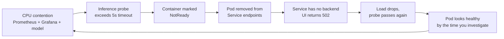

The probe intended to detect degradation was *causing* an outage, and erasing the evidence on its way out. `kubectl get endpoints -n llm ollama` showed an empty endpoint list against a `Running` pod — and because a pod is excluded from endpoints if **any** container in it is NotReady, the exporter sidecar's own probe could trigger the same 502s independently.

### The split

The fix was to stop asking one mechanism two different questions:

| Question | Answered by | Cost | Cadence |
|---|---|---|---|
| *Can this pod accept traffic right now?* | Kubernetes readiness probe — `ollama list \| grep -q 'llama3.2:1b'` | Cheap, no generation | every 20s |
| *Is the model actually producing tokens, fast enough?* | Exporter sidecar — real generation, `num_predict: 5`, timed into a Prometheus histogram | Expensive, but off the critical path | every 30s |

The second question no longer has the power to remove the pod from service. It writes to `ollama_request_duration_seconds` instead, and an alert reads the rolling p95:

```yaml
- alert: OllamaHighInferenceLatency
  expr: histogram_quantile(0.95, sum(rate(ollama_request_duration_seconds_bucket[5m])) by (le)) > 10
  for: 2m
```

The sidecar placement is deliberate: same pod, same network namespace, so it reaches `localhost:11434` with no Service or DNS indirection in the path. If the exporter can't reach Ollama from inside Ollama's own pod, that's a genuine fault and not a networking artefact.

### What it buys, and what it costs

**Buys:** transient slowness stops causing pod churn and 502s. Degradation becomes a continuous, rolling p95 you can see and alert on, instead of a binary flap that repairs itself before you can run `kubectl describe`.

**Costs — and this is a real tradeoff, not a free win:** a model that is genuinely broken but still passes `ollama list` now stays in the Service endpoints and keeps receiving traffic. Detection moves from roughly 60 seconds (3 failed probes × 20s) to roughly 2½ minutes (30s probe interval + the alert's `for: 2m`). I traded **faster automatic ejection** for **not ejecting healthy pods under load** — the right call for a single-node deployment where there is no second replica to fail over to, and the wrong call if you had three replicas and could afford to shoot one.

---

## Architecture

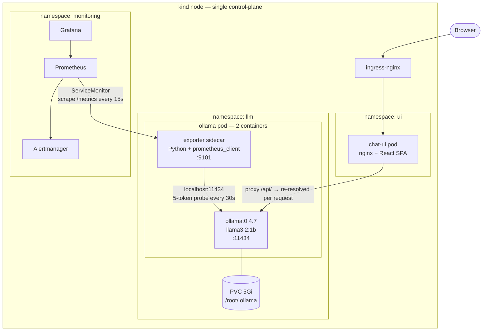

**Repository layout**

| Path | What's in it |
|---|---|
| [k8s/](k8s/) | kind cluster config, Ollama Deployment + Service + ServiceMonitor, chat UI, Ingress, PrometheusRule, Grafana dashboard JSON, Helm values |
| [scripts/ollama-exporter/](scripts/ollama-exporter/) | The custom exporter — 192 lines of Python, runs as a sidecar |
| [scripts/benchmark/](scripts/benchmark/) | Offline benchmark: prompts, runner, LLM-as-judge scorer, raw + scored results |
| [ui/](ui/) | React + TypeScript chat UI with `/` (chat) and `/compare` (benchmark) routes |
| [blog/](blog/) | Long-form write-up and supporting artefacts |
| [docs/](docs/) | Screenshots and the demo GIF used on this page |

### What the exporter actually exposes

Eight metric families, polled from `/api/tags`, `/api/ps`, and a real generation against `/api/generate`:

| Metric | Type | Meaning |
|---|---|---|
| `ollama_up` | gauge | Health poll reached Ollama this cycle |
| `ollama_loaded_models` | gauge | Models currently resident in RAM |
| `ollama_installed_models` | gauge | Models present on disk |
| `ollama_model_size_bytes` | gauge | Per-model size, labelled by model |
| `ollama_request_duration_seconds` | histogram | Synthetic inference latency; buckets `0.5,1,2,5,10,20,30,60,120` |
| `ollama_tokens_total` | counter | Cumulative tokens from probe generations |
| `ollama_tokens_per_second` | gauge | Throughput from the most recent probe |
| `ollama_probe_errors_total` | counter | Failures, labelled `health` or `probe` |

Health failures and probe failures are counted separately and don't clear each other — `ollama_up` reflects only whether the API answered, so "the API is up but generation is broken" is a state you can actually see.

Three alert rules in [k8s/ollama-alerts.yaml](k8s/ollama-alerts.yaml): `OllamaDown` (critical, `ollama_up == 0` for 1m), `OllamaHighInferenceLatency` (warning, p95 > 10s for 2m), `OllamaProbeErrorsRising` (warning, error rate > 0.1/s for 3m).

---

## Is a 1B model actually worth running?

The reliability work is only interesting if the model is worth deploying. Ten prompts across factual recall, reasoning, code generation, and summarization went to both the in-cluster Llama 3.2 1B and GPT-4o-mini, sequentially, with latency, token counts, and cost recorded per prompt. A separate pass scored every response 1–5 on accuracy, completeness, and clarity.

| | Llama 3.2 1B (in-cluster, CPU) | GPT-4o-mini (API) |
|---|---|---|
| Total wall-clock | 844.8 s | 56.8 s |
| Output tokens | 2,394 | 2,389 |
| Throughput | 2.8 tok/s aggregate · 4.1 tok/s mean-per-prompt | 42.1 · 39.9 |
| Quality | **121 / 150 (80.7 %)** | **148 / 150 (98.7 %)** |
| API cost | $0 | $0.001498 |

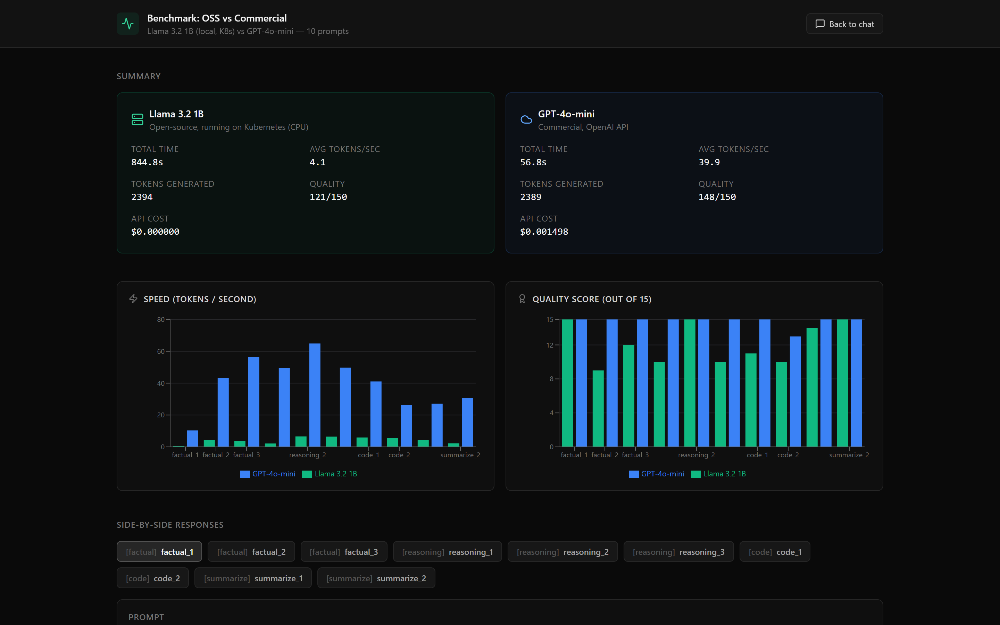

The headline reads *commercial wins* — but the per-prompt breakdown is more useful than the total:

- **The 1B model tied at 15/15 on three of ten prompts** — "what is Kubernetes", a p50-vs-p99 latency reasoning question, and a TL;DR summarization.
- **Wall-clock told you nothing about answer quality.** The two slowest local responses took almost four minutes each — 238.1 s and 235.2 s, against 7.3 s and 11.6 s from the API. On the first it scored 10/15; on the second, 15/15, exactly matching GPT-4o-mini. Same latency, opposite outcomes.
- It fell down on specifics-heavy recall (9/15 on "name three Prometheus query functions" — it named them, then got the descriptions wrong) and on one ranked-reasoning prompt (10/15 on OOMKill causes: not wrong, just shallow).
- The commercial model dropped points exactly once, on a YAML-generation prompt (13/15).

So: for bounded, factual, summarization-shaped work, a 1B model on a laptop is genuinely competitive at zero marginal cost. For specifics-heavy or multi-step reasoning, it isn't there.

**On the judging, honestly:** the judge is GPT-4o-mini — the same model that produced one of the two response sets. Position was randomized per prompt and unshuffled afterward to blunt ordering bias, but self-preference is a real effect and the commercial score is likely inflated. The UI says so on the page rather than burying it. Treat these as directional.

---

## Running it

Requires Docker Desktop, `kubectl`, `kind`, Helm, and Node 18+.

```bash
# 1. Cluster (maps 30080→8080, 30090→9090, 30030→3000)
kind create cluster --config k8s/kind-cluster.yaml

# 2. Build images FIRST — the Ollama pod references the exporter image,
#    and the manifests use imagePullPolicy: IfNotPresent
docker build -t ollama-exporter:0.1.0 scripts/ollama-exporter/
kind load docker-image ollama-exporter:0.1.0 --name drdroid-llm

cd ui && npm install && npm run build
docker build -t drdroid-chat-ui:0.1.2 .
kind load docker-image drdroid-chat-ui:0.1.2 --name drdroid-llm
cd ..

# 3. Namespace — the manifests reference it but don't create it
kubectl create namespace llm

# 4. Model runtime + exporter sidecar
kubectl apply -f k8s/ollama.yaml
kubectl exec -n llm deployment/ollama -c ollama -- ollama pull llama3.2:1b

# 5. Monitoring stack
helm repo add prometheus-community https://prometheus-community.github.io/helm-charts
helm install kps prometheus-community/kube-prometheus-stack \
  -n monitoring --create-namespace -f k8s/prometheus-values.yaml

# 6. Alert rules
kubectl apply -f k8s/ollama-alerts.yaml

# 7. UI + ingress
kubectl apply -f k8s/chat-ui.yaml
kubectl apply -f https://raw.githubusercontent.com/kubernetes/ingress-nginx/controller-v1.12.1/deploy/static/provider/kind/deploy.yaml
kubectl label node drdroid-llm-control-plane ingress-ready=true
kubectl apply -f k8s/chat-ui-ingress.yaml
```

**Access:**

```bash
# Chat UI
kubectl port-forward -n ingress-nginx svc/ingress-nginx-controller 8080:80   # → http://localhost:8080

# Grafana is exposed via NodePort 30030, mapped to host port 3000 by the kind config
#   → http://localhost:3000   (credentials are in k8s/prometheus-values.yaml — see Tradeoffs)
# Then import k8s/grafana-dashboard.json via Dashboards → New → Import

# Prometheus has no NodePort, so the 9090 host mapping is unused — port-forward instead:
kubectl get svc -n monitoring          # confirm the service name for your release
kubectl port-forward -n monitoring svc/kps-kube-prometheus-stack-prometheus 9090:9090
```

**Benchmark** (needs an OpenAI key — see [.env.example](.env.example)):

```bash
cd scripts/benchmark
npm install
cp ../../.env.example .env      # then fill in OPENAI_API_KEY
npx tsx benchmark.ts            # writes results-raw.json
npx tsx judge.ts                # scores it, writes results.json
```

The benchmark is fully offline with respect to the UI: generation happens in Node, and `/compare` renders a committed `results.json`. Re-running the benchmark never touches the UI, and the UI never makes a network call to render results.

### Responsive

The UI is usable on a phone — the comparison grid collapses to a single column and the side-by-side responses stack.

<table>
<tr>
<td width="50%">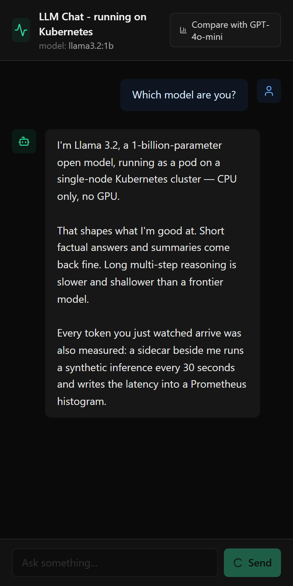</td>
<td width="50%">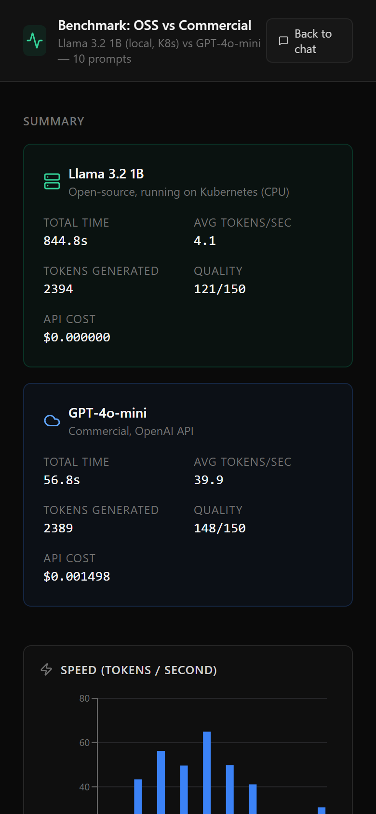</td>
</tr>
</table>

<details>
<summary><strong>More screenshots</strong> — desktop chat, full benchmark page, scrape target, stock cluster dashboard</summary>
<br>
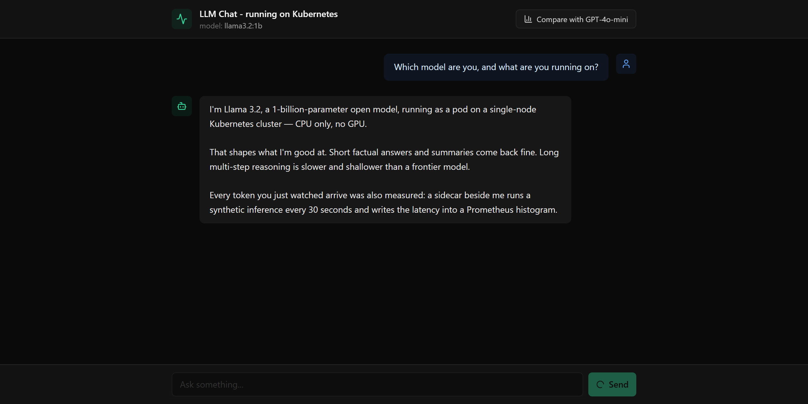
<p><em>Chat at 1280px, streaming a response token by token.</em></p>
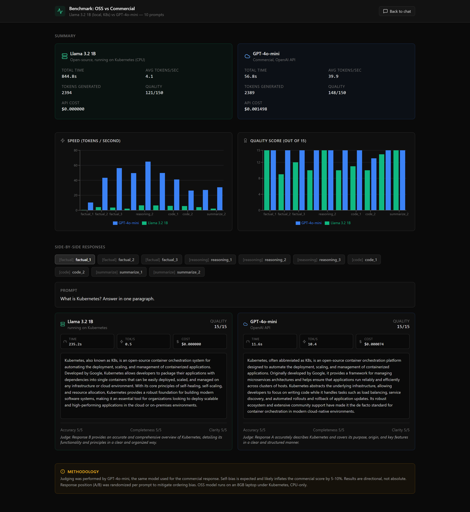
<p><em>The full <code>/compare</code> route: summary cards, both charts, per-prompt side-by-side responses with judge reasoning, and the methodology disclosure.</em></p>
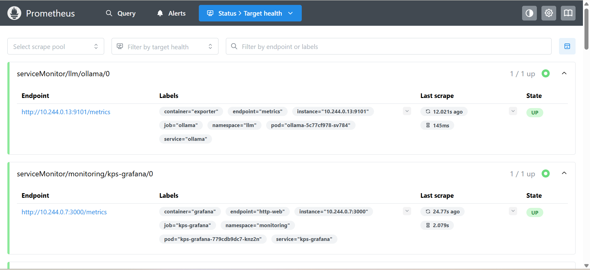
<p><em>Prometheus discovering the exporter through the ServiceMonitor — this is the link between the sidecar and the alert rules.</em></p>
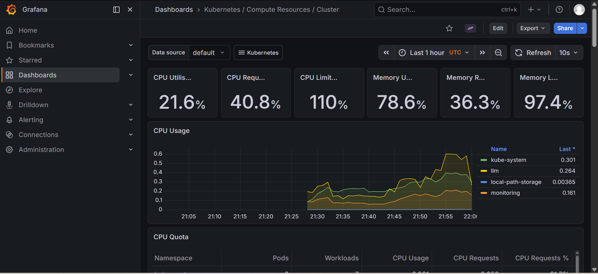
<p><em>What kube-prometheus-stack gives you for free — useful, but note that nothing here mentions a token, a model, or inference latency. That gap is what the custom exporter fills.</em></p>
</details>

---

## Tradeoffs and known gaps

Everything here is real and verified against the code in this repo — not hypothetical.

**Security**

- **Grafana's admin password is hardcoded** in [k8s/prometheus-values.yaml](k8s/prometheus-values.yaml) in plaintext. Blast radius is small — the service is NodePort-bound to localhost on a throwaway kind cluster with `persistence: false` — but it's a credential in a public repo. *Fix:* `kubectl create secret generic grafana-admin --from-literal=admin-password=...` and reference it via `grafana.admin.existingSecret`.
- **The ingress exposes the entire Ollama API, unauthenticated.** [ui/nginx.conf](ui/nginx.conf) proxies `location /api/` with `proxy_pass $upstream$request_uri`, which forwards *every* path and method — so `/api/pull`, `/api/delete`, and `/api/create` are reachable, not just `/api/chat`. Today it's bound to localhost; on any real network this is a hole. *Fix:* restrict the proxy to an exact `location = /api/chat` with `limit_except POST { deny all; }`, and put auth at the ingress.
- **No rate limiting anywhere.** One client in a loop can saturate the model. *Fix:* `nginx.ingress.kubernetes.io/limit-rps` on the Ingress, plus a bounded request queue.

**Correctness / operations**

- **No `Namespace` object for `llm`.** The manifests place resources in it but never create it, so `kubectl apply -f k8s/ollama.yaml` fails on a fresh cluster — hence the explicit `kubectl create namespace llm` in the steps above. *Fix:* prepend a `Namespace` object to `k8s/ollama.yaml`, the way `chat-ui.yaml` already does for `ui`.
- **The Helm chart version is unpinned.** `helm install` without `--version` means this stack is not reproducible over time; the original run used chart v83.6.0, but nothing in the repo enforces that. *Fix:* pin `--version` and commit a `Chart.lock`.
- **The exporter catches bare `Exception`** in its health poll ([exporter.py:121](scripts/ollama-exporter/exporter.py#L121)), so a bug in the metric code would be silently recorded as an Ollama health failure. *Fix:* narrow to `URLError, TimeoutError, json.JSONDecodeError` and let anything else crash the poller loudly.
- **Two host port mappings in the kind config are dead.** `30080→8080` and `30090→9090` are declared, but nothing binds NodePort 30080 and Prometheus's service isn't a NodePort — access goes through `port-forward` instead. *Fix:* either set `prometheus.service.type=NodePort, nodePort=30090` in the values file, or drop the unused mappings.

**Testing and quality**

- **There are no tests.** Not for the exporter's metric emission, not for the UI's NDJSON stream parser, not for the benchmark's cost arithmetic. That parser in particular — buffering partial lines across chunk boundaries in [ui/src/Chat.tsx](ui/src/Chat.tsx) — is exactly the kind of code that deserves a unit test. *Fix:* `pytest` against a stub Ollama for the exporter, and Vitest over recorded NDJSON fixtures for the stream reader.
- **The judge's randomization isn't auditable.** Position is shuffled per prompt and unshuffled after, but which order was used is never recorded in `results.json`, so the debiasing can't be verified after the fact. With n=10 it also can't fully cancel out. *Fix:* persist the assignment per prompt, and run each pair in both orders.
- **`countWords()` in [benchmark.ts](scripts/benchmark/benchmark.ts) is dead code** — defined, never called.
- **The UI bundle is 663 kB** (198 kB gzipped) in a single chunk, because Recharts is imported eagerly and the chat route pays for a charting library it never renders. *Fix:* `React.lazy()` the `/compare` route.
- **Accessibility gaps.** There is not a single `aria-*` attribute in the UI. The chat message list isn't a live region, so streaming tokens are never announced to a screen reader; and the Recharts bar charts render as SVG without `accessibilityLayer`, so while the legend names the two series, the individual values are unreachable assistive-technology-side. *Fix:* `aria-live="polite"` on the message container, and a visually-hidden data table beside each chart.
- **The 1B model's quality ceiling is real.** 80.7 % against a frontier-adjacent model, and it degrades specifically on specifics-heavy recall. This stack is the right shape for bounded tasks, not a drop-in replacement for a hosted frontier model.

**Scope**

- Single node, single replica, CPU-only. `strategy: Recreate` is correct here because two Ollama pods would contend for one `ReadWriteOnce` volume — but it also means every deploy is a hard restart with a cold model load. Multi-replica would need `ReadWriteMany` or per-pod model storage, plus the warm-up job this doesn't have.

---

## Author

**Chinmoy Paul** — Data Science & Artificial Intelligence, IIT Guwahati

I work on ML systems and the infrastructure that keeps them observable in production — model deployment, instrumentation, and the reliability engineering that sits between "it runs" and "I'd trust it on call".

[](https://chinmoypaul.vercel.app/)
[](https://www.linkedin.com/in/chinmoy-paul)
[](https://github.com/chinmoypaul8897)
[](mailto:hello.chinmoypaul@gmail.com)

## License

MIT — see [LICENSE](LICENSE).
